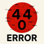

# We Offer the Support and Care Our Girls Deserve
<strong>
In this project, we developed a system based on Arduino, which can also be adapted to the ESP32, capable of measuring the force of kicks and touches made by players on a soccer ball. The main idea is to provide accurate data on the intensity and technique applied in each action.
</strong>

>> Where We Focus::

We aim to offer a practical tool both for training and performance analysis, enabling players to track their progress, identify areas for improvement, and encourage sports practice in a more technical and scientific way.

# 
 # In Our Project🗂️
<strong>Our system focuses on identifying areas for improvement and encouraging sports practice in a more technical and scientific way</strong>

>> Learn more about our project:

.svg/64px-YouTube_full-color_icon_(2017).svg.png)
<a href="https://youtu.be/mpvPlb8FJKs"> Explanatory Video
 
%2019.11.13_d333cb35.jpg)
<a href="https://www.tinkercad.com/things/cwMRDdtIUm3-circuito-de-forca-?sharecode=9yPXvnIw1y9zixqjGD34_Y87SNiKPYB1XcAP7_vBDYc"> Project on Tinkercad

<h2> How It Works🤷‍♂️ </h2>

- 🔧We use a force sensor to monitor and record the intensity of an impact, such as a kick or touch on the ball.

- The sensor is connected to the Arduino, which processes the information and converts it into a force value. A LED can be triggered to indicate that a pre-set minimum force has been reached, providing immediate visual feedback.

- All components are safely and neatly connected on a breadboard, using jumper wires to simplify assembly and testing of the project.

>> System Architecture Overview

<h3>The system has a simple and functional architecture</h3>

<h2>(Input)⬅️</h2>

- The force applied to the ball is captured by the FSR sensor.

- The sensor converts mechanical pressure into electrical resistance variation.

<h2>Processing</h2>

- The Arduino reads the analog values from the FSR sensor.

- The microcontroller processes the data to calculate the intensity of the kick or touch.

<h2>(Output)➡️</h2>

- Results can be visualized on a LED (visual force indication) or sent to the serial monitor on a computer for logging and analysis.

- The system allows tracking the players’ progress over time.
#

<h3> ⚙️Components Used⚙️ </h3>

- Arduino UNO (1x)

- SFSR – Force Sensitive Resistor (1x)

- LEDs(1x)

- Resistors(2x 220Ω)

- Protoboard(1x)
#

<h2>Information Collection System</h2>

We used Node-RED to collect the data

<h3> ⚙️Collection Method ⚙️ </h3>

- Inject code: {"application":"sensor-forca","value":200,"timestamp":1699988999}{"application":"sensor-forca","value":200,"timestamp":1699988999}

Input

Output

#

# Build It Yourself!

Follow the steps below

> <h3>Follow this assembly pattern:</h3>

 

>> <h3>After assembling, simply implement the code.txt file we provide, and everything is ready!!</h3>

#

<h2>We at ©Company 404 thank you for your attention! 👋</h2>

